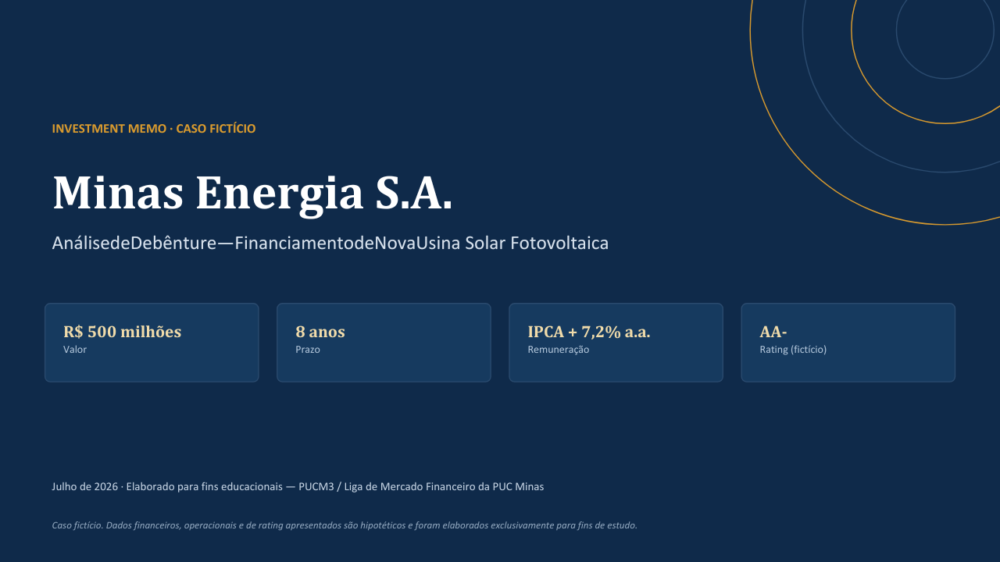

# Investment Memo | Corporate Credit Analysis

## Minas Energia S.A. — Debenture Case Study

This repository contains a fictional corporate credit analysis developed to simulate the evaluation of a debenture issuance in the Brazilian capital market.

The project assesses the issuer's financial profile, credit quality, capital structure, transaction terms, risks and investment attractiveness.

> **Disclaimer:** This is an educational case study. The company, financial information, rating, comparable companies and transaction structure are fictional and were created exclusively for learning and portfolio purposes.

## Project Objective

The objective of this project is to apply concepts related to:

- Corporate Credit Analysis
- Corporate Finance
- Fixed Income
- Financial Statement Analysis
- Infrastructure Financing
- Investment Research

## Transaction Overview

| Item | Description |
|---|---|
| Issuer | Minas Energia S.A. — fictional company |
| Industry | Electric power generation |
| Instrument | Simple, non-convertible debenture |
| Issuance amount | R$ 500 million |
| Maturity | 8 years |
| Remuneration | IPCA + 7.2% p.a. |
| Credit rating | AA- — fictional |
| Use of proceeds | Construction of a solar power plant |

## Scope of Analysis

The Investment Memo includes:

- Business and transaction overview
- Debenture terms and conditions
- Financial and credit analysis
- Leverage and interest coverage metrics
- Risk assessment
- Guarantee and covenant structure
- Peer comparison
- Investment recommendation

## Key Credit Metrics

| Metric | Result |
|---|---:|
| Net Debt / EBITDA | 2.4x |
| Interest Coverage | Approximately 4.5x |
| EBITDA Margin | 25.7% |
| Return on Equity | Approximately 14.0% |

## Project Files

[View the complete Investment Memo](./Investment_Memo_Minas_Energia.pdf)

## Skills Demonstrated

- Corporate Credit Analysis
- Fixed Income Analysis
- Financial Modeling
- Credit Metrics
- Risk Assessment
- Investment Research
- Financial Presentation
- Microsoft Excel
- Microsoft PowerPoint

## Author

**Christian Bicalho**

Economics Student — PUC Minas

Corporate Finance | Credit Analysis | FP&A | Power BI | Excel | SAP
